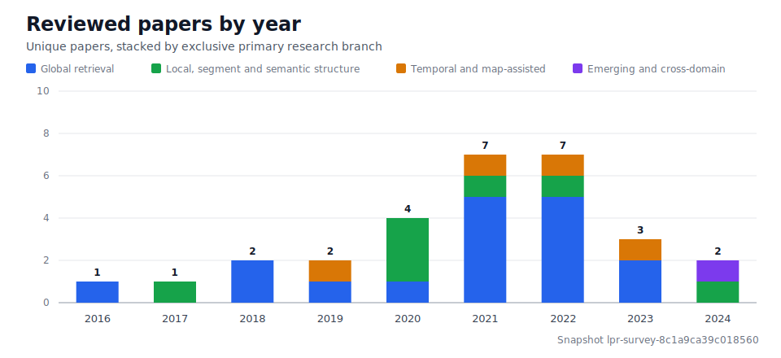
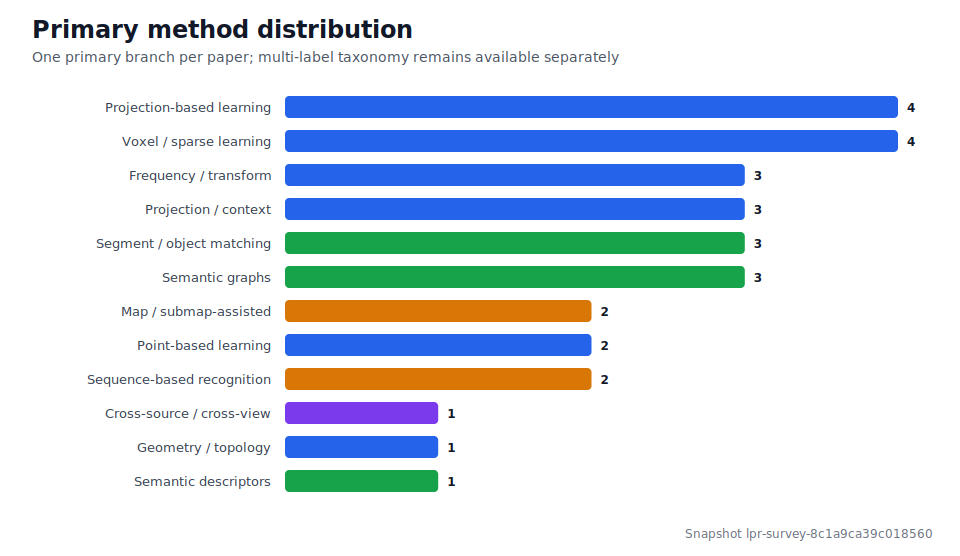

<!-- Generated by LivingSurveyAgent; do not edit manually. -->

# LiDAR Place Recognition Living Survey

An evidence-reviewed, continuously updated map of LiDAR place recognition research, maintained by [@xiaoshi22-ops](https://github.com/xiaoshi22-ops).

| Evidence-reviewed | Indexed | In review | Published coverage |
| ---: | ---: | ---: | :--- |
| **30** | **44** | **30** | **2010–2024** |

The canonical public-scope corpus currently contains **104 unique works**. Only entries that pass version-metadata and primary-classification gates appear in the public paper lists; pending records remain in the review queue.

## Field at a glance

## Research landscape

Each paper has one additive primary branch for overview statistics and any number of reviewed method tags for detailed browsing.

| Primary branch | Papers |
| --- | ---: |
| Global retrieval | 58 |
| Local, segment and semantic structure | 8 |
| Temporal and map-assisted | 5 |
| Emerging and cross-domain | 3 |

[Open the research tree and branch paper lists →](landscape.md)

## Explore

- [Methods organized by year](by-year.md)
- [Research landscape: one primary branch per paper](landscape.md)
- [Multi-label method index](taxonomy.md)
- [Snapshot changelog](CHANGELOG.md)
- [How to propose a correction or addition](CONTRIBUTING.md)
- [Machine-readable snapshot](data/snapshot.json)

## Update policy

- The 2024–2026 catch-up and later literature checks run on a weekly cadence.
- Journal, conference, and preprint versions are distinguished; a preprint is not presented as a peer-reviewed paper.
- Newly discovered papers enter the review queue before they can change public counts or summaries.

## Trust model

- A paper is published only after its preferred version metadata and taxonomy assignments are reviewed.
- Structured facts are rendered only from accepted assertions with source locators.
- “Initial reviewed corpus” does not mean “representative” or “milestone”; those labels require a separate human decision.
- Restricted PDFs, evidence quotations, local paths, credentials, and unreviewed model output are never published.

Snapshot: `lpr-survey-911453a86068e183` (`911453a86068`)
