<!-- Generated by LivingSurveyAgent; do not edit manually. -->

# LPR research landscape

Every published paper is counted once under the branch that best represents its primary contribution. Reviewed method taxonomy assignments remain multi-label facets, so their counts may overlap; the landscape counts below are additive.

```mermaid
flowchart TB
  root["LiDAR Place Recognition<br/>74 papers"]
  n_global_retrieval["Global retrieval<br/>58 papers"]
  n_global_retrieval_handcrafted["Handcrafted descriptors<br/>19 papers"]
  n_global_retrieval_handcrafted_projection_context["Projection / context<br/>9 papers"]
  n_global_retrieval_handcrafted_frequency_transform["Frequency / transform<br/>3 papers"]
  n_global_retrieval_handcrafted_geometry_topology["Geometry / topology<br/>7 papers"]
  n_global_retrieval_learned["Learned descriptors<br/>39 papers"]
  n_global_retrieval_learned_projection["Projection-based learning<br/>10 papers"]
  n_global_retrieval_learned_point["Point-based learning<br/>16 papers"]
  n_global_retrieval_learned_voxel_sparse["Voxel / sparse learning<br/>9 papers"]
  n_global_retrieval_learned_multimodal["Multimodal learning<br/>4 papers"]
  n_local_structural["Local, segment and semantic structure<br/>8 papers"]
  n_local_structural_segment_object["Segment / object matching<br/>4 papers"]
  n_local_structural_semantic_graph["Semantic graphs<br/>3 papers"]
  n_local_structural_semantic_descriptor["Semantic descriptors<br/>1 paper"]
  n_temporal_map["Temporal and map-assisted<br/>5 papers"]
  n_temporal_map_sequence["Sequence-based recognition<br/>2 papers"]
  n_temporal_map_map_assisted["Map / submap-assisted<br/>3 papers"]
  n_emerging_cross_domain["Emerging and cross-domain<br/>3 papers"]
  n_emerging_cross_domain_cross_source["Cross-source / cross-view<br/>1 paper"]
  n_emerging_cross_domain_lifelong_uncertainty["Lifelong / uncertainty<br/>2 papers"]
  root --> n_global_retrieval
  n_global_retrieval --> n_global_retrieval_handcrafted
  n_global_retrieval_handcrafted --> n_global_retrieval_handcrafted_projection_context
  n_global_retrieval_handcrafted --> n_global_retrieval_handcrafted_frequency_transform
  n_global_retrieval_handcrafted --> n_global_retrieval_handcrafted_geometry_topology
  n_global_retrieval --> n_global_retrieval_learned
  n_global_retrieval_learned --> n_global_retrieval_learned_projection
  n_global_retrieval_learned --> n_global_retrieval_learned_point
  n_global_retrieval_learned --> n_global_retrieval_learned_voxel_sparse
  n_global_retrieval_learned --> n_global_retrieval_learned_multimodal
  root --> n_local_structural
  n_local_structural --> n_local_structural_segment_object
  n_local_structural --> n_local_structural_semantic_graph
  n_local_structural --> n_local_structural_semantic_descriptor
  root --> n_temporal_map
  n_temporal_map --> n_temporal_map_sequence
  n_temporal_map --> n_temporal_map_map_assisted
  root --> n_emerging_cross_domain
  n_emerging_cross_domain --> n_emerging_cross_domain_cross_source
  n_emerging_cross_domain --> n_emerging_cross_domain_lifelong_uncertainty
```

## Primary branch totals

| Branch | Papers | Share |
| --- | ---: | ---: |
| Global retrieval | 58 | 78.4% |
| Local, segment and semantic structure | 8 | 10.8% |
| Temporal and map-assisted | 5 | 6.8% |
| Emerging and cross-domain | 3 | 4.1% |

## Papers by primary branch

### Projection / context (9)

BEV, polar, range-view, contextual, or discretized handcrafted representations.

- **[Effectively Detecting Loop Closures using Point Cloud Density Maps](papers/effectively-detecting-loop-closures-using-point-cloud-density-maps.md)** · ICRA · `unknown` · `Projection / context` · `Handcrafted` · [Paper](https://www.ipb.uni-bonn.de/pdfs/gupta2024icra.pdf)
- **[OSK: A Novel LiDAR Occupancy Set Key-Based Place Recognition Method in Urban Environment](papers/osk-a-novel-lidar-occupancy-set-key-based-place-recognition-method-in-urban-environment.md)** · TIM · `conference` · `Projection / context` · `Handcrafted` · [Paper](https://doi.org/10.1109/tim.2024.3375408)
- **[Scan Context++: Structural Place Recognition Robust to Rotation and Lateral Variations in Urban Environments:](papers/scan-context-structural-place-recognition-robust-to-rotation-and-lateral-variations-in-urban-environments.md)** · TRO · `arxiv_preprint` · `Projection / context` · `Handcrafted` · [Paper](https://arxiv.org/abs/2109.13494) · [Code](https://github.com/asdfghjkl623/scancontext)
- **[Weighted scan context: Global descriptor with sparse height feature for loop closure detection:](papers/weighted-scan-context-global-descriptor-with-sparse-height-feature-for-loop-closure-detection.md)** · ICCCR · `conference` · `Projection / context` · `Handcrafted` · [Paper](https://doi.org/10.1109/icccr49711.2021.9349417)
- **[Intensity Scan Context: Coding Intensity and Geometry Relations for Loop Closure Detection:](papers/intensity-scan-context-coding-intensity-and-geometry-relations-for-loop-closure-detection.md)** · ICRA · `arxiv_preprint` · `Projection / context` · `Handcrafted` · [Paper](https://arxiv.org/abs/2003.05656)
- **[Scan Context: Egocentric Spatial Descriptor for Place Recognition Within 3D Point Cloud Map](papers/scan-context-egocentric-spatial-descriptor-for-place-recognition-within-3d-point-cloud-map.md)** · IROS · `unknown` · `Projection / context` · `Handcrafted` · [Paper](https://ieeexplore.ieee.org/document/8593953)
- **[M2DP: A novel 3D point cloud descriptor and its application in loop closure detection](papers/m2dp-a-novel-3d-point-cloud-descriptor-and-its-application-in-loop-closure-detection.md)** · IROS · `unknown` · `Projection / context` · `Handcrafted` · [Paper](https://ieeexplore.ieee.org/document/7759060) · [Code](https://github.com/LiHeUA/M2DP)
- **[A fast histogram-based similarity measure for detecting loop closures in 3-D LIDAR data](papers/a-fast-histogram-based-similarity-measure-for-detecting-loop-closures-in-3-d-lidar-data.md)** · IROS · `unknown` · `Projection / context` · `Handcrafted` · [Paper](https://ieeexplore.ieee.org/document/7353454)
- **[Loop closure detection using small-sized signatures from 3D LIDAR data](papers/loop-closure-detection-using-small-sized-signatures-from-3d-lidar-data.md)** · SSRR · `unknown` · `Projection / context` · `Handcrafted` · [Paper](https://ieeexplore.ieee.org/document/6106765)

### Frequency / transform (3)

Fourier, Radon, sinogram, and related transform-domain methods.

- **[Fresco: Frequency-domain scan context for lidar-based place recognition with translation and rotation invariance:](papers/fresco-frequency-domain-scan-context-for-lidar-based-place-recognition-with-translation-and-rotation-invariance.md)** · ICARCV · `arxiv_preprint` · `Frequency / transform` · `Handcrafted` · [Paper](https://arxiv.org/abs/2206.12628) · [Code](https://github.com/soytony/FreSCo)
- **[One RING to Rule Them All: Radon Sinogram for Place Recognition, Orientation and Translation Estimation:](papers/one-ring-to-rule-them-all-radon-sinogram-for-place-recognition-orientation-and-translation-estimation.md)** · IROS · `arxiv_preprint` · `Frequency / transform` · `Handcrafted` · [Paper](https://arxiv.org/abs/2204.07992)
- **[LiDAR Iris for Loop-Closure Detection:](papers/lidar-iris-for-loop-closure-detection.md)** · IROS · `arxiv_preprint` · `Frequency / transform` · `Handcrafted` · [Paper](https://arxiv.org/abs/1912.03825) · [Code](https://github.com/JoestarK/LiDAR-Iris)

### Geometry / topology (7)

Explicit points, triangles, contours, graphs, or other geometric structures.

- **[BTC: A Binary and Triangle Combined Descriptor for 3-D Place Recognition](papers/btc-a-binary-and-triangle-combined-descriptor-for-3-d-place-recognition.md)** · TRO · `conference` · `Geometry / topology` · `Handcrafted` · [Paper](https://doi.org/10.1109/tro.2024.3353076)
- **[Binary Image Fingerprint: Stable Structure Identifier for 3D LiDAR Place Recognition ``RAL``](papers/binary-image-fingerprint-stable-structure-identifier-for-3d-lidar-place-recognition-ral.md)** · 待确认 · `conference` · `Geometry / topology` · `Handcrafted` · [Paper](https://doi.org/10.1109/lra.2023.3297063)
- **[Contour Context: Abstract Structural Distribution for 3D LiDAR Loop Detection and Metric Pose Estimation](papers/contour-context-abstract-structural-distribution-for-3d-lidar-loop-detection-and-metric-pose-estimation.md)** · ICRA · `arxiv_preprint` · `Geometry / topology` · `Handcrafted` · [Paper](https://arxiv.org/abs/2302.06149)
- **[Place Recognition of Large-Scale Unstructured Orchards With Attention Score Maps](papers/place-recognition-of-large-scale-unstructured-orchards-with-attention-score-maps.md)** · RAL · `conference` · `Geometry / topology` · `Handcrafted` · [Paper](https://doi.org/10.1109/lra.2023.3234744)
- **[STD: Stable Triangle Descriptor for 3D place recognition](papers/std-stable-triangle-descriptor-for-3d-place-recognition.md)** · ICRA · `arxiv_preprint` · `Geometry / topology` · `Handcrafted` · [Paper](https://arxiv.org/abs/2209.12435) · [Code](https://github.com/hku-mars/STD)
- **[LiPMatch: LiDAR Point Cloud Plane Based Loop-Closure](papers/lipmatch-lidar-point-cloud-plane-based-loop-closure.md)** · RAL · `conference` · `Geometry / topology` · `Handcrafted` · [Paper](https://doi.org/10.1109/lra.2020.3021374)
- **[c-m2dp: A fast point cloud descriptor with color information to perform loop closure detection](papers/c-m2dp-a-fast-point-cloud-descriptor-with-color-information-to-perform-loop-closure-detection.md)** · CASE · `unknown` · `Geometry / topology` · `Handcrafted` · [Paper](https://ieeexplore.ieee.org/document/8842896)

### Projection-based learning (10)

Learned BEV, range, spherical, or other projected representations.

- **[CVTNet: A Cross-View Transformer Network for LiDAR-Based Place Recognition in Autonomous Driving Environments](papers/cvtnet-a-cross-view-transformer-network-for-lidar-based-place-recognition-in-autonomous-driving-environments.md)** · TII · `arxiv_preprint` · `Projection-based learning` · `Learning` · [Paper](https://arxiv.org/abs/2302.01665)
- **[OverlapMamba: Novel Shift State Space Model for LiDAR-based Place Recognition](papers/overlapmamba-novel-shift-state-space-model-for-lidar-based-place-recognition.md)** · arXiv · `conference` · `Projection-based learning` · `Learning` · [Paper](https://doi.org/10.1109/lra.2025.3582109)
- **[BEVPlace: Learning LiDAR-based Place Recognition using Bird's Eye View Images](papers/bevplace-learning-lidar-based-place-recognition-using-bird-s-eye-view-images.md)** · ICCV · `unknown` · `Projection-based learning` · `Learning` · [Paper](https://openaccess.thecvf.com/content/ICCV2023/html/Luo_BEVPlace_Learning_LiDAR-based_Place_Recognition_using_Birds_Eye_View_Images_ICCV_2023_paper.html) · [Code](https://github.com/zjuluolun/BEVPlace)
- **[Spherical Transformer for LiDAR-Based 3D Recognition](papers/spherical-transformer-for-lidar-based-3d-recognition.md)** · CVPR · `arxiv_preprint` · `Projection-based learning` · `Learning` · [Paper](https://arxiv.org/abs/2303.12766)
- **[DSC: Deep Scan Context Descriptor for Large-Scale Place Recognition](papers/dsc-deep-scan-context-descriptor-for-large-scale-place-recognition.md)** · MFI · `arxiv_preprint` · `Projection-based learning` · `Learning` · [Paper](https://arxiv.org/abs/2111.13838)
- **[Object Scan Context: Object-centric Spatial Descriptor for Place Recognition within 3D Point Cloud Map](papers/object-scan-context-object-centric-spatial-descriptor-for-place-recognition-within-3d-point-cloud-map.md)** · arXiv · `arxiv_preprint` · `Projection-based learning` · `Learning` · [Paper](https://arxiv.org/abs/2206.03062)
- **[OverlapTransformer: An Efficient and Yaw-Angle-Invariant Transformer Network for LiDAR-Based Place Recognition](papers/overlaptransformer-an-efficient-and-yaw-angle-invariant-transformer-network-for-lidar-based-place-recognition.md)** · RAL · `arxiv_preprint` · `Projection-based learning` · `Learning` · [Paper](https://arxiv.org/abs/2203.03397) · [Code](https://github.com/haomo-ai/OverlapTransformer)
- **[DiSCO: Differentiable Scan Context With Orientation](papers/disco-differentiable-scan-context-with-orientation.md)** · RAL · `arxiv_preprint` · `Projection-based learning` · `Learning` · [Paper](https://arxiv.org/abs/2010.10949)
- **[OverlapNet: a siamese network for computing LiDAR scan similarity with applications to loop closing and localization](papers/overlapnet-a-siamese-network-for-computing-lidar-scan-similarity-with-applications-to-loop-closing-and-localization.md)** · Autonomous Robots · `conference` · `Projection-based learning` · `Learning` · [Paper](https://doi.org/10.1007/s10514-021-09999-0) · [Code](https://github.com/PRBonn/OverlapNet)
- **[1-Day Learning, 1-Year Localization: Long-Term LiDAR Localization Using Scan Context Image](papers/1-day-learning-1-year-localization-long-term-lidar-localization-using-scan-context-image.md)** · RAL · `conference` · `Projection-based learning` · `Learning` · [Paper](https://doi.org/10.1109/lra.2019.2897340)

### Point-based learning (16)

Encoders operating primarily on raw points or point neighborhoods.

- **[P-GAT: Pose-Graph Attentional Network for Lidar Place Recognition](papers/p-gat-pose-graph-attentional-network-for-lidar-place-recognition.md)** · RAL · `arxiv_preprint` · `Point-based learning` · `Learning` · [Paper](https://arxiv.org/abs/2309.00168)
- **[SelFLoc: Selective feature fusion for large-scale point cloud-based place recognition](papers/selfloc-selective-feature-fusion-for-large-scale-point-cloud-based-place-recognition.md)** · KBS · `arxiv_preprint` · `Point-based learning` · `Learning` · [Paper](https://arxiv.org/abs/2306.01205)
- **[VNI-Net: Vector Neurons-based Rotation-Invariant Descriptor for LiDAR Place Recognition](papers/vni-net-vector-neurons-based-rotation-invariant-descriptor-for-lidar-place-recognition.md)** · arXiv · `arxiv_preprint` · `Point-based learning` · `Learning` · [Paper](https://arxiv.org/abs/2308.12870)
- **[Efficient 3D Point Cloud Feature Learning for Large-Scale Place Recognition](papers/efficient-3d-point-cloud-feature-learning-for-large-scale-place-recognition.md)** · TIP · `arxiv_preprint` · `Point-based learning` · `Learning` · [Paper](https://arxiv.org/abs/2101.02374)
- **[HiTPR: Hierarchical Transformer for Place Recognition in Point Cloud](papers/hitpr-hierarchical-transformer-for-place-recognition-in-point-cloud.md)** · ICRA · `arxiv_preprint` · `Point-based learning` · `Learning` · [Paper](https://arxiv.org/abs/2204.05481)
- **[Improving Point Cloud Based Place Recognition with Ranking-based Loss and Large Batch Training](papers/improving-point-cloud-based-place-recognition-with-ranking-based-loss-and-large-batch-training.md)** · ICPR · `arxiv_preprint` · `Point-based learning` · `Learning` · [Paper](https://arxiv.org/abs/2203.00972)
- **[InCloud: Incremental Learning for Point Cloud Place Recognition](papers/incloud-incremental-learning-for-point-cloud-place-recognition.md)** · IROS · `arxiv_preprint` · `Point-based learning` · `Learning` · [Paper](https://arxiv.org/abs/2203.00807)
- **[Retriever: Point Cloud Retrieval in Compressed 3D Maps](papers/retriever-point-cloud-retrieval-in-compressed-3d-maps.md)** · ICRA · `unknown` · `Point-based learning` · `Learning` · [Paper](https://ieeexplore.ieee.org/document/9811785)
- **[A registration-aided domain adaptation network for 3d point cloud based place recognition](papers/a-registration-aided-domain-adaptation-network-for-3d-point-cloud-based-place-recognition.md)** · IROS · `arxiv_preprint` · `Point-based learning` · `Learning` · [Paper](https://arxiv.org/abs/2012.05018)
- **[Pyramid Point Cloud Transformer for Large-Scale Place Recognition](papers/pyramid-point-cloud-transformer-for-large-scale-place-recognition.md)** · ICCV · `unknown` · `Point-based learning` · `Learning` · [Paper](https://openaccess.thecvf.com/content/ICCV2021/html/Hui_Pyramid_Point_Cloud_Transformer_for_Large-Scale_Place_Recognition_ICCV_2021_paper.html)
- **[SOE-Net: A Self-Attention and Orientation Encoding Network for Point Cloud Based Place Recognition](papers/soe-net-a-self-attention-and-orientation-encoding-network-for-point-cloud-based-place-recognition.md)** · CVPR · `unknown` · `Point-based learning` · `Learning` · [Paper](https://openaccess.thecvf.com/content/CVPR2021/html/Xia_SOE-Net_A_Self-Attention_and_Orientation_Encoding_Network_for_Point_Cloud_CVPR_2021_paper.html)
- **[LPD-Net: 3D Point Cloud Learning for Large-Scale Place Recognition and Environment Analysis](papers/lpd-net-3d-point-cloud-learning-for-large-scale-place-recognition-and-environment-analysis.md)** · ICCV · `unknown` · `Point-based learning` · `Learning` · [Paper](https://openaccess.thecvf.com/content_ICCV_2019/html/Liu_LPD-Net_3D_Point_Cloud_Learning_for_Large-Scale_Place_Recognition_and_ICCV_2019_paper.html) · [Code](https://github.com/Suoivy/LPD-net)
- **[OREOS: Oriented Recognition of 3D Point Clouds in Outdoor Scenarios](papers/oreos-oriented-recognition-of-3d-point-clouds-in-outdoor-scenarios.md)** · IROS · `arxiv_preprint` · `Point-based learning` · `Learning` · [Paper](https://arxiv.org/abs/1903.07918)
- **[PCAN: 3D Attention Map Learning Using Contextual Information for Point Cloud Based Retrieval](papers/pcan-3d-attention-map-learning-using-contextual-information-for-point-cloud-based-retrieval.md)** · CVPR · `arxiv_preprint` · `Point-based learning` · `Learning` · [Paper](https://arxiv.org/abs/1904.09793)
- **[PointNetVLAD: Deep Point Cloud Based Retrieval for Large-Scale Place Recognition](papers/pointnetvlad-deep-point-cloud-based-retrieval-for-large-scale-place-recognition.md)** · CVPR · `conference` · `Point-based learning` · `Learning` · [Paper](https://doi.org/10.1109/cvpr.2018.00470) · [Code](https://github.com/mikacuy/pointnetvlad)
- **[Learning to close the loop from 3D point clouds](papers/learning-to-close-the-loop-from-3d-point-clouds.md)** · IROS · `unknown` · `Point-based learning` · `Learning` · [Paper](https://ieeexplore.ieee.org/document/5651013)

### Voxel / sparse learning (9)

Voxel, sparse-convolution, and discretized 3D encoders.

- **[LCDNet: Deep Loop Closure Detection and Point Cloud Registration for LiDAR SLAM](papers/lcdnet-deep-loop-closure-detection-and-point-cloud-registration-for-lidar-slam.md)** · TRO · `arxiv_preprint` · `Voxel / sparse learning` · `Learning` · [Paper](https://arxiv.org/abs/2103.05056) · [Code](https://github.com/robot-learning-freiburg/LCDNet)
- **[LoGG3D-Net: Locally Guided Global Descriptor Learning for 3D Place Recognition](papers/logg3d-net-locally-guided-global-descriptor-learning-for-3d-place-recognition.md)** · ICRA · `arxiv_preprint` · `Voxel / sparse learning` · `Learning` · [Paper](https://arxiv.org/abs/2109.08336) · [Code](https://github.com/csiro-robotics/LoGG3D-Net)
- **[MinkLoc3D-SI: 3D LiDAR Place Recognition With Sparse Convolutions, Spherical Coordinates, and Intensity](papers/minkloc3d-si-3d-lidar-place-recognition-with-sparse-convolutions-spherical-coordinates-and-intensity.md)** · RAL · `conference` · `Voxel / sparse learning` · `Learning` · [Paper](https://doi.org/10.1109/lra.2021.3136863)
- **[SVT-Net: Super Light-Weight Sparse Voxel Transformer for Large Scale Place Recognition](papers/svt-net-super-light-weight-sparse-voxel-transformer-for-large-scale-place-recognition.md)** · AAAI · `conference` · `Voxel / sparse learning` · `Learning` · [Paper](https://doi.org/10.1609/aaai.v36i1.19934)
- **[MinkLoc3D: Point Cloud Based Large-Scale Place Recognition](papers/minkloc3d-point-cloud-based-large-scale-place-recognition.md)** · WACV · `unknown` · `Voxel / sparse learning` · `Learning` · [Paper](https://openaccess.thecvf.com/content/WACV2021/html/Komorowski_MinkLoc3D_Point_Cloud_Based_Large-Scale_Place_Recognition_WACV_2021_paper.html) · [Code](https://github.com/jac99/MinkLoc3D)
- **[NDT-Transformer: Large-Scale 3D Point Cloud Localisation using the Normal Distribution Transform Representation](papers/ndt-transformer-large-scale-3d-point-cloud-localisation-using-the-normal-distribution-transform-representation.md)** · ICRA · `arxiv_preprint` · `Voxel / sparse learning` · `Learning` · [Paper](https://arxiv.org/abs/2103.12292)
- **[TransLoc3D : Point Cloud based Large-scale Place Recognition using Adaptive Receptive Fields](papers/transloc3d-point-cloud-based-large-scale-place-recognition-using-adaptive-receptive-fields.md)** · arXiv · `arxiv_preprint` · `Voxel / sparse learning` · `Learning` · [Paper](https://arxiv.org/abs/2105.11605) · [Code](https://github.com/slothfulxtx/TransLoc3D)
- **[SpoxelNet: Spherical Voxel-based Deep Place Recognition for 3D Point Clouds of Crowded Indoor Spaces](papers/spoxelnet-spherical-voxel-based-deep-place-recognition-for-3d-point-clouds-of-crowded-indoor-spaces.md)** · IROS · `conference` · `Voxel / sparse learning` · `Learning` · [Paper](https://doi.org/10.1109/iros45743.2020.9341549)
- **[Voxel-Based Representation Learning for Place Recognition Based on 3D Point Clouds](papers/voxel-based-representation-learning-for-place-recognition-based-on-3d-point-clouds.md)** · IROS · `unknown` · `Voxel / sparse learning` · `Learning` · [Paper](https://ieeexplore.ieee.org/document/9340992)

### Multimodal learning (4)

Place representations learned across LiDAR and another sensor or map source.

- **[AdaFusion: Visual-LiDAR Fusion With Adaptive Weights for Place Recognition](papers/adafusion-visual-lidar-fusion-with-adaptive-weights-for-place-recognition.md)** · RAL · `arxiv_preprint` · `Multimodal learning` · `Learning` · [Paper](https://arxiv.org/abs/2111.11739)
- **[CORAL: Colored structural representation for bi-modal place recognition](papers/coral-colored-structural-representation-for-bi-modal-place-recognition.md)** · IROS · `arxiv_preprint` · `Multimodal learning` · `Learning` · [Paper](https://arxiv.org/abs/2011.10934)
- **[Spherical Multi-Modal Place Recognition for Heterogeneous Sensor Systems](papers/spherical-multi-modal-place-recognition-for-heterogeneous-sensor-systems.md)** · ICRA · `arxiv_preprint` · `Multimodal learning` · `Learning` · [Paper](https://arxiv.org/abs/2104.10067)
- **[PIC-Net: Point Cloud and Image Collaboration Network for Large-Scale Place Recognition](papers/pic-net-point-cloud-and-image-collaboration-network-for-large-scale-place-recognition.md)** · arXiv · `arxiv_preprint` · `Multimodal learning` · `Learning` · [Paper](https://arxiv.org/abs/2008.00658)

### Segment / object matching (4)

Recognition through segment or object descriptors and associations.

- **[On the descriptive power of LiDAR intensity images for segment-based loop closing in 3-D SLAM](papers/on-the-descriptive-power-of-lidar-intensity-images-for-segment-based-loop-closing-in-3-d-slam.md)** · IROS · `arxiv_preprint` · `Segment / object matching` · `Learning` · [Paper](https://arxiv.org/abs/2108.01383)
- **[Seed: A Segmentation-Based Egocentric 3D Point Cloud Descriptor for Loop Closure Detection](papers/seed-a-segmentation-based-egocentric-3d-point-cloud-descriptor-for-loop-closure-detection.md)** · IROS · `conference` · `Segment / object matching` · `Handcrafted` · [Paper](https://doi.org/10.1109/iros45743.2020.9341517)
- **[SegMap: Segment-based mapping and localization using data-driven descriptors](papers/segmap-segment-based-mapping-and-localization-using-data-driven-descriptors.md)** · IJRR · `conference` · `Segment / object matching` · `Learning` · [Paper](https://doi.org/10.1177/0278364919863090)
- **[SegMatch: Segment based place recognition in 3D point clouds](papers/segmatch-segment-based-place-recognition-in-3d-point-clouds.md)** · ICRA · `conference` · `Segment / object matching` · `Handcrafted` · [Paper](https://doi.org/10.1109/icra.2017.7989618) · [Code](https://github.com/ethz-asl/segmap)

### Semantic graphs (3)

Graph-based recognition using semantic entities and relations.

- **[SGLC: Semantic Graph-Guided Coarse-Fine-Refine Full Loop Closing for LiDAR SLAM](papers/sglc-semantic-graph-guided-coarse-fine-refine-full-loop-closing-for-lidar-slam.md)** · arXiv · `arxiv_preprint` · `Semantic graphs` · `Learning` · [Paper](https://arxiv.org/abs/2407.08106) · [Code](https://github.com/nubot-nudt/SGLC)
- **[BoxGraph: Semantic Place Recognition and Pose Estimation from 3D LiDAR](papers/boxgraph-semantic-place-recognition-and-pose-estimation-from-3d-lidar.md)** · IROS · `arxiv_preprint` · `Semantic graphs` · `Learning` · [Paper](https://arxiv.org/abs/2206.15154)
- **[SRNet: A 3D Scene Recognition Network using Static Graph and Dense Semantic Fusion](papers/srnet-a-3d-scene-recognition-network-using-static-graph-and-dense-semantic-fusion.md)** · Computer Graphics Forum · `conference` · `Semantic graphs` · `Learning` · [Paper](https://doi.org/10.1111/cgf.14146)

### Semantic descriptors (1)

Semantic representations without an explicit relational graph.

- **[SSC: Semantic Scan Context for Large-Scale Place Recognition](papers/ssc-semantic-scan-context-for-large-scale-place-recognition.md)** · IROS · `arxiv_preprint` · `Semantic descriptors` · `Learning` · [Paper](https://arxiv.org/abs/2107.00382) · [Code](https://github.com/lilin-hitcrt/SSC)

### Sequence-based recognition (2)

Ordered scan sequences and learned or handcrafted temporal context.

- **[SeqOT: A Spatial–Temporal Transformer Network for Place Recognition Using Sequential LiDAR Data](papers/seqot-a-spatial-temporal-transformer-network-for-place-recognition-using-sequential-lidar-data.md)** · TIE · `arxiv_preprint` · `Sequence-based recognition` · `Learning` · [Paper](https://arxiv.org/abs/2209.07951) · [Code](https://github.com/BIT-MJY/SeqOT)
- **[SeqLPD: Sequence Matching Enhanced Loop-Closure Detection Based on Large-Scale Point Cloud Description for Self-Driving Vehicles](papers/seqlpd-sequence-matching-enhanced-loop-closure-detection-based-on-large-scale-point-cloud-description-for-self-driving-v.md)** · IROS · `arxiv_preprint` · `Sequence-based recognition` · `Learning` · [Paper](https://arxiv.org/abs/1904.13030)

### Map / submap-assisted (3)

Explicit scan-to-map, submap, or persistent-map recognition.

- **[Fast and Accurate Deep Loop Closing and Relocalization for Reliable LiDAR SLAM](papers/fast-and-accurate-deep-loop-closing-and-relocalization-for-reliable-lidar-slam.md)** · TRO · `arxiv_preprint` · `Map / submap-assisted` · `Learning` · [Paper](https://arxiv.org/abs/2309.08086) · [Code](https://github.com/nubot-nudt/LCR-Net)
- **[RING++: Roto-Translation Invariant Gram for Global Localization on a Sparse Scan Map](papers/ring-roto-translation-invariant-gram-for-global-localization-on-a-sparse-scan-map.md)** · TRO · `arxiv_preprint` · `Map / submap-assisted` · `Handcrafted` · [Paper](https://arxiv.org/abs/2210.05984)
- **[EgoNN: Egocentric Neural Network for Point Cloud Based 6DoF Relocalization at the City Scale](papers/egonn-egocentric-neural-network-for-point-cloud-based-6dof-relocalization-at-the-city-scale.md)** · RAL · `conference` · `Map / submap-assisted` · `Learning` · [Paper](https://doi.org/10.1109/lra.2021.3133593) · [Code](https://github.com/jac99/Egonn)

### Cross-source / cross-view (1)

Recognition across sensing sources, platforms, viewpoints, or map domains.

- **[CrossLoc3D: Aerial-Ground Cross-Source 3D Place Recognition](papers/crossloc3d-aerial-ground-cross-source-3d-place-recognition.md)** · ICCV · `arxiv_preprint` · `Cross-source / cross-view` · `Learning` · [Paper](https://arxiv.org/abs/2303.17778) · [Code](https://github.com/rayguan97/crossloc3d)

### Lifelong / uncertainty (2)

Continual adaptation, novelty, memory, or calibrated uncertainty.

- **[Uncertainty-Aware Lidar Place Recognition in Novel Environments](papers/uncertainty-aware-lidar-place-recognition-in-novel-environments.md)** · IROS · `arxiv_preprint` · `Lifelong / uncertainty` · `Learning` · [Paper](https://arxiv.org/abs/2210.01361)
- **[BioSLAM: A Bioinspired Lifelong Memory System for General Place Recognition](papers/bioslam-a-bioinspired-lifelong-memory-system-for-general-place-recognition.md)** · TRO · `arxiv_preprint` · `Lifelong / uncertainty` · `Learning` · [Paper](https://arxiv.org/abs/2208.14543)

Landscape version: `0.1.0` · Snapshot: `lpr-survey-911453a86068e183`

[Browse by year](by-year.md) · [Open the multi-label index](taxonomy.md)
